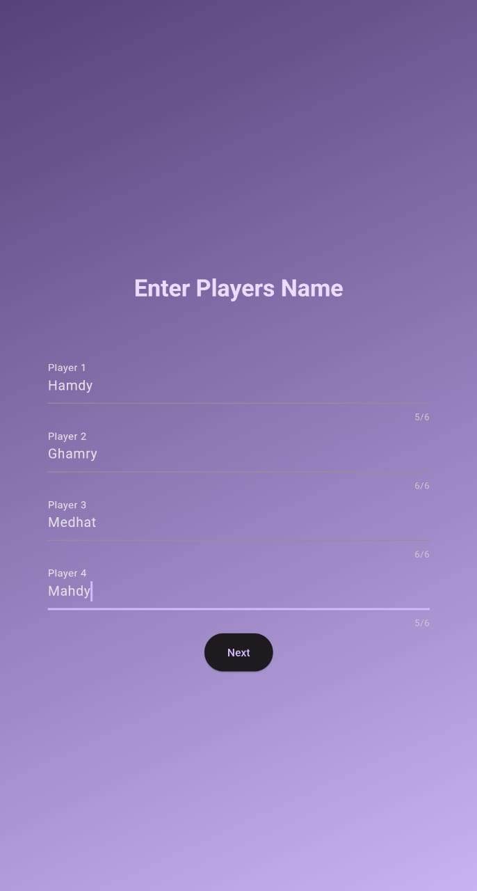

# Skru Score Calculator

## Overview

The Skru Score Calculator is a Flutter application designed to sum the scores of every player at the end of each round in the "SKRU" game. This tool makes it easy to keep track of scores and determine the winner after each game.

## Features

- **Welcome Screen**: Greets users with "Welcome to Skru Calculator" and displays the game logo.
- **Player Setup**: Users can enter the number of players and their names.
- **Scoreboard**: Allows users to input scores for each player in every round. The total score for each player is displayed at the end of the column.
- **Winner Announcement**: After entering all the scores, users can click "Finish" to determine and display the winner.
- **Responsive Design**: The app is responsive to phone rotation and adapts to different screen sizes.
- **Dark and Light Mode**: Supports dark and light mode, following the system settings.

## Screenshots

  - 

  - 

  - 

  - 

# Contributing

**This project is currently in beta. Contributions are welcome!**

